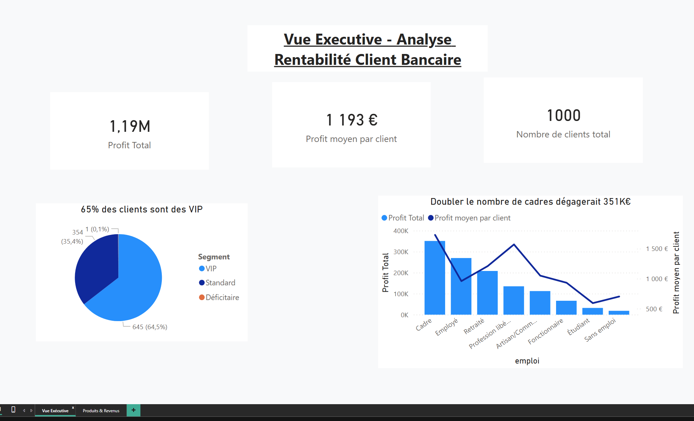
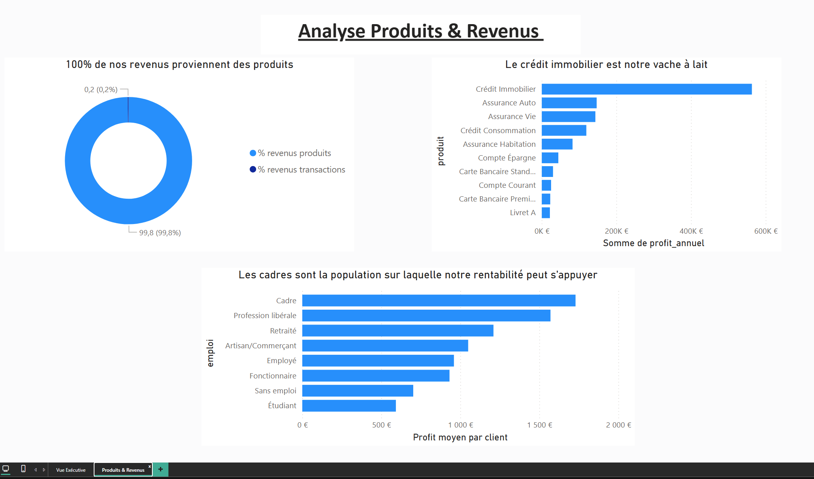

Analyse de Rentabilité Client - Secteur Bancaire

Contexte du Projet:

La rentabilité d'une banque dépend de la rentabilité de ces clients.
Nous avons ici une banque de 1000 clients.

Problématique : Dans cet établissement bancaire de 1000 clients, le but de cette analyse sera de trouver les leviers d'optimisation de rentabilité de la banque.

---

Résultats principaux:

Rentabilité globale
Le profit total de l'entreprise est de 1,19 M€.
Le profit moyen par client est de 1 193 €.

Segmentation
-64,5% clients sont des clients VIP et ont un profit supérieur à 500€. Il représente 645 clients avec un profit moyen de 1 697€.
-35,4% clients sont des clients Standard et ont un profit entre 0 et 500 €. Il représente 354 clients avec un profit moyen de 276€.
-0,1% clients sont des clients Déficitaires et on un profit inférieur à 0. Cela représente un seul client.

Insights & Analyse Business

Le profit de la banque n'est pas concentrée que sur une partie de ces clients.
Les 20% de clients les plus rentables (200 clients) génèrent 57% du profit total.
La banque a donc un équilibre modérée de son profit et ne dépend pas que de quelques gros clients
La base de client reste diversifiée.

Le compte courant est notre produit le plus souscrit dans toutes les catégories de clients. Cependant, la rentabilité de la banque repose
sur le crédit immobilier. C'est notre produit le plus rentable avec 2 669€. de profit moyen par client. C'est la vache à lait.

Notre clientèle est composée principalement de cadres avec 203 personnes générant 1729€ de profit moyen. Les professions libérales, moins
nombreuses (86 personnes), génèrent 1 571€ de profit moyen.

Les produits représentent 99,8% du profit de la banque. Les transactions ne représent que 0,2% des revenus.

---

Dataset

-Table 1 Clients
1.client_id
2.nom_complet
3.age
4.emploi
5.balance_moyenne
6.date_acquisition
7.ancienneté_mois
8.coût acquisition
9.segment

-Table 2 Transactions
1.transaction_id
2.client_id
3.date_transaction
4.type_transaction
5.montant
6.frais_générés

-Table 3 Produits_souscrits
1.client_id
2.produit
3.revenus_annuels
4.coût_gestion_annuel
5.profit_annuel

-Table 4 Recap_rentabilite
1.client_id
2.revenus_transactions
3.revenus_annuels
4.coûts_totaux
5.profit_net
6.segment_calcule

---

Dashboard Power BI

Page 1 - Vue Executive

Page 2 - Analyse Produits & Revenus

---

Technologies Utilisées

- SQL (DuckDB) - Analyses de données et requêtes complexes (CTEs, window functions, agrégations)
- Python - Génération de données réalistes et automatisation
- Pandas - Manipulation et traitement de données

---

Méthodologie

1. Génération des Données à l'aide d'un script python
Création d'un dataset bancaire réaliste avec distributions cohérentes :
- Table Clients
- Table Transactions
- Table Produits souscrits
- Table Récap Rentabilité

2. Calcul de Rentabilité
3. Segmentation client
4. Analyse de la rentabilité clients

---

Compétences développées

Génération d'un script python grâce à l'IA
Requêtes SQL - Common Table Expressions (CTEs)

---

Insights et Recommendations

1. Un client rapporte en moyenne 276€.S'il devient VIP, il rapporte 1 697€. Le gain est de 1 421€ par client. Convertir 100 clients Standard en VIP dégagerait 142 000€ de profit supplémentaire.
2. 59,6% des cadres n'ont pas de crédit immobilier. Convaincre ces 121 cadres représenterait environ 323K€ de profit potentiel.
3. Doubler le nombre de cadres permettrait d'augmenter le profit de 351K€.
4. Développer des offres de cartes premium ciblant cadres et professions libérales pour diversifier les revenus au-delà des produits

À Propos

Renée Michèle Niangoran
Data Analyst
10 ans d'expérience dans le domaine financier
